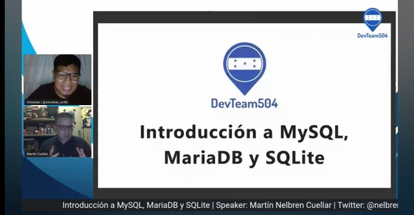

# Introducción a MySQL, MariaDB y SQLite

## Presentación

[Introducción a MySQL, MariaDB y SQLite.pdf](https://raw.githubusercontent.com/nelbren/intro_mysql_mariadb_y_sqlite/master/Intro_a_MySQL_MariaDB_y_SQLite.pdf)

## Webminar

## Demostración

### Códigos

- **[bash](https://github.com/nelbren/intro_mysql_mariadb_y_sqlite/blob/master/bash/db_crear_bd.bash)**

- **[python](https://github.com/nelbren/intro_mysql_mariadb_y_sqlite/tree/master/python)**

### Extras

- **[sqlite-web](https://github.com/nelbren/intro_mysql_mariadb_y_sqlite/tree/master/sqlite/sqlite-web)**
- **[python-rich](https://github.com/nelbren/intro_mysql_mariadb_y_sqlite/tree/master/mariadb/python-rich)**

